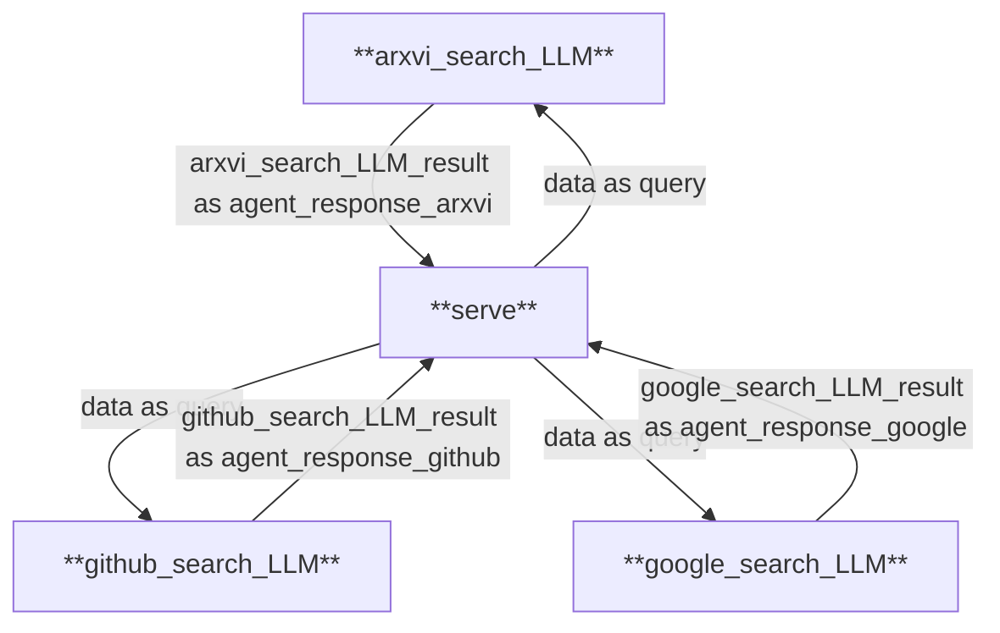

# **Who_Knows**

<!-- PROJECT LOGO -->

<br />

<p align="center">
  <a href="https://github.com/whatiname888/who_knows">
    
  </a>

<h3 align="center">Who_Knows</h3>
  <p align="center">
    基于MoFA的深度智能搜索引擎
    <br />
    <a href="https://github.com/whatiname888/who_knows"><strong>本项目的Github仓库链接 »</strong></a>
    <br />本项目由[爱北京，来工大]团队制作
    <br />
    <a href="https://github.com/whatiname888/who_knows/blob/main/who_knows_search/README.md">查看使用文档</a>
    ·
    <a href="https://github.com/whatiname888/who_knows/issues">报告Bug</a>
    ·
    <a href="https://github.com/whatiname888/who_knows/pulls">提出新特性</a>
  </p>

</p>

# 目录

- [项目简介](#项目简介)
- [Getting_started](#Getting_started)
  - [环境依赖配置](#环境依赖配置)
  - [运行说明](#运行说明)
- [创新点与突破点](#创新点与突破点)
  - [创新点：大小脑设计](#创新点大小脑设计)
  - [突破点：Deepsearch 策略](#突破点deepsearch-策略)
- [技术难点与解决方案](#技术难点与解决方案)
  - [技术难点](#技术难点)
  - [解决方案](#解决方案)
- [运行案例](#运行案例)
- [团队介绍](#团队介绍)
- [鸣谢](#鸣谢)

项目环境：
Python 3.11.10
rust
pip 24.2

## 项目简介
who_knows 是一个基于 mofa 框架，使用 dora 组织数据流的搜索项目。它通过大模型与小模型的协同工作来提炼和过滤海量搜索结果，自动拓展关键词，帮助用户从繁琐的信息中快速找到关键信息，使搜索过程更加高效、直接。

- **核心特点**  
  - 基于智能体协作的架构设计，将用户交互和任务执行分为独立模块
  - 实现动态调整搜索策略，逐层提炼关键信息，保证数据输出的精准与全面
- **功能说明**  
  - xiaowang是一个以智能体驱动的搜索引擎，利用创新的**左右脑设计**与**Deepsearch 策略**实现高效的信息检索和数据分析，为用户提供一个智能、动态、深度且友好的信息获取平台
- **使用场景**  
  - 用户厌倦了传统搜索引擎中良萎不齐的信息来源、铺天盖地的广告宣传与繁琐至极的挨个浏览，希望有一款自动收集信息、自动整理分析的准确高效的新一代搜索引擎。
---
**whoknows-agent搜索引擎架构图**


**agent数据流框图**


## Getting_started

### 环境依赖配置

> 注：请在Linux和MacOS系统上运行，本项目依赖框架暂不支持Windows

**本项目所需框架及语言版本如下**

* Python 3.11.10
  pip 24.2
  Rust 1.81.0
  dora-cli 0.3.6


1. 克隆此项目:

 ```bash
 git clone https://github.com/whatiname888/who_knows.git
 ```

2. 使用Python 3.10或以上环境：

- 如果出现环境版本不匹配，请检查python和pip版本并重新配置,建议使用虚拟环境。

```bash
pip --version
python --version
```

3. 项目环境部署(安装)

- 安装python环境的依赖：

```bash
# 安装 UV 包管理器 加快mofa安装
pip install uv
#安装python后端框架
pip install flask
```

```bash
# 安装 Rust
curl --proto '=https' --tlsv1.2 -sSf https://sh.rustup.rs | sh
# 安装 Dora
cargo install dora-cli
# 验证安装
rustc --version
cargo --version
dora --version
```

```bash
cd mofa/python
# 安装依赖，以下两个命令建议都执行一遍，因为有时uv安装会失败，但是uv的安装速度更快
uv pip install -e .
pip install -e .
```
安装完毕之后，可以使用`mofa --help`命令查看Cli帮助信息

恭喜你，在上述步骤后你已经成功搭建好了运行who_knows的全部基础！！

### 运行说明

在这部分我将讲解如何在你的设备上配置并运行who_knows

由于我们的程序需要使用在线大模型API运行的，因此在启动前要将你的API密钥，模型名称，API接口URL填入配置文件。

以下是我们的项目文件结构：
```
 who_knows/
 ├── image/ # 图片
 ├── mofa/ # mofa框架仓库
 ├── node_hub/ # 各节点代码
 ├── who_knows_search/ # dataflow配置文件
 │ ├── data/# 视频，照片，实例测试结果
 │ ├── README.md
 │ ├── who_knows_dataflow.yml
 │ └── who_knows_dataflow-graph.html
 ├── .gitignore # Git 忽略文件
 ├── .gitmodules # 项目配置文件
 ├── LICENSE# 许可证
 └── README.md # readme文件
```

在相应目录建立以下配置文件并填写你的API密钥，模型名称，API接口URL：

```bash
who_knows/node_hub/serve/serve/config.yaml
who_knows/node_hub/arxiv_search_LLM/arxiv_search_LLM/config.yaml
who_knows/node_hub/github_search_LLM/github_search_LLM/config.yaml
who_knows/node_hub/google_search_LLM/google_search_LLM/config.yaml
```

本项目使用**Openai**API框架，以下为config.yaml文件内容示例：

```yaml
api_key:   #您的API密钥
base_url: https://api.deepseek.com  #API的基础URL
model: deepseek-chat #模型名称
```

- 顺序执行以下命令以启动智能体流程：

>注：请确保在项目根目录下运行以下命令，并确保运行前进入了虚拟环境
```bash
cd who_knows_search
dora up
dora build who_knows_dataflow.yml
dora start who_knows_dataflow.yml
```

等待显示以下内容后，表示数据流启动成功：
```bash
INFO  dataflow `xxxx-xxx-xxx` on daemon `xxxx-xxx-xxx` google_search_LLM daemon: node is ready
INFO  dataflow `xxxx-xxx-xxx` on daemon `xxxx-xxx-xxx` github_search_LLM daemon: node is ready
INFO  dataflow `xxxx-xxx-xxx` on daemon `xxxx-xxx-xxx` arxiv_search_LLM daemon: node is ready
INFO  dataflow `xxxx-xxx-xxx` on daemon `xxxx-xxx-xxx` daemon: all nodes are ready, starting dataflow
```


打开一个新的终端窗口，进入相同虚拟环境后运行 `whos_serve`

```bash
whos_serve
```
看到以下输出即为yun_serve启动成功：
```bash
 * Serving Flask app 'serve.main'
 * Debug mode: on
WARNING: This is a development server. Do not use it in a production deployment. Use a production WSGI server instead.
 * Running on http://127.0.0.1:5000
Press CTRL+C to quit
 * Restarting with watchdog (inotify)
 * Debugger is active!
 * Debugger PIN: xxx-xxx-xxx
```
>此示例仅作演示使用，实际部署请使用Nginx或其他Web服务器托管。


由于dora启动速度的原因若刚刚执行完 `dora start who_knows_dataflow.yml`立马执行 `whos_serve`可能会报错，如遇报错请等待几秒后再次执行`whos_serve`命令。

打开浏览器，输入`http://localhost:5000/`，进入到搜索引擎主页，输入查询内容，点击搜索按钮，即可看到搜索结果。

> 注：由于网络及电脑性能等原因，输出可能有不同程度延迟，请耐心等待模型输出结果。

## 创新点与突破点

###  创新点：大小脑设计

- **右脑（交互模块）**  
  负责与用户实时沟通，通过自然语言理解技术获取查询意图，并实时反馈交互状态。

- **左脑（任务代理模块）**  
  分工明确、协同工作的智能代理集合，负责处理所有后端任务，包括数据的初步抓取和深层次的关联搜索，确保输出的结果准确而全面。

- **总结**  
  我们设计的实时交互中继架构，采用双模型协同工作机制：前端轻量化交互模型专责对话流维持与结果渲染，在用户发起请求的瞬间即开始生成交互反馈信号；后端智能路由模型同步执行多模态语义解析，通过动态关键词提取引擎并行检索GitHub/arXiv/Google三大知识库。两套模型通过事件驱动型信息流实现解耦，使得界面响应延迟与后端计算耗时完全隔离。该架构确保每个用户查询经历「交互保障→语义解析」两次独立模型处理阶段，在维持零停顿对话体验的同时，为后续扩展自定义爬虫接口预留了标准化接入点。


###  突破点：Deepsearch 策略

- **初步搜索：**  
  用户输入查询内容后，系统将会首先提取关键信息，通过爬虫技术抓取互联网数据形成初步搜索结果。

- **深层关联分析：**  
  根据初步结果进一步提炼关键词，开展第二轮更深层次的搜索，从而精细挖掘出隐藏的价值和关联信息。


## 技术难点与解决方案

### 技术难点
Dora框架对并发的支持不佳，无法充分利用多核CPU性能，导致处理能力受限，高并发场景下容易出现性能瓶颈，并且长时间运行的任务会阻塞整个系统。
### 解决方案
我们通过Flask的多线程和消息队列机制实现了类似并发的效果。具体来说，它使用线程安全的队列(message_queues)来管理不同会话的消息，并通过独立的监控线程(monitor_external_changes)处理外部事件，同时利用全局锁(system_lock, search_lock)来保证数据一致性，从而在Dora框架的单线程限制下实现了多会话并发处理。


## 运行案例

### 案例一

**用户：**
```
帮我找个叫mofa的智能体框架
```

**DeepSeek-R1：**
```markdown
</think>
好的，用户让我帮忙找一个叫“mofa”的智能体框架。首先，我需要仔细看看用户提供的搜索结果，看看有没有提到这个框架。

先看第一个网页，是关于GOSIM超级智能体黑客马拉松大赛的。里面提到参赛者使用了开源的MoFA框架，看来这个MoFA可能和智能体相关。不过网页里没有详细说明MoFA是什么，但结合比赛内容，应该是一个智能体开发框架，可能用于构建多层次的动态反思智能体。这个信息挺重要的，需要记下来。2

接下来是第二个网页，标题是“探秘多组学数据分析:MOFA,一种综合集成框架”。这里提到的MOFA全称是Multi-Omics Factor Analysis，用于多组学数据整合，看起来是生物信息学领域的工具，不是智能体框架。不过用户可能拼写错误，把MOFA写成mofa，但根据用户的问题，应该是要找智能体相关的框架，所以这个可能不是用户需要的，但需要留意。3

第三个网页列举了11个流行的AI智能体框架，里面没有提到MOFA，不过有AutoGPT、BabyAGI、SuperAGI等，可能用户提到的mofa不在其中。8

第四个和第五个网页对比了五大多智能体框架，包括AutoGen、CrewAI、LangGraph等，同样没有MOFA的踪影。910

第六个网页介绍魔搭社区开源的AgentScope，也没有提到MOFA。11

第七个网页继续对比多智能体框架，同样没有MOFA的信息。12

第八个网页是关于金属有机框架（MOF）的，显然和用户的问题无关。13

现在回到第一个网页，里面明确提到了MoFA框架，参赛者用它来开发项目。结合用户可能的大小写错误，比如MoFA和mofa其实是同一个，这个可能就是用户要找的框架。另外，在网页1里，MoFA和xMind框架一起被提及，都是开源的，用于构建智能体项目，挑战ChatGPT。所以可以确定，MoFA是一个开源的智能体框架，应用于黑客松比赛中，可能具有动态反思和多层次优化的能力。而第二个网页的MOFA虽然名称相似，但属于生物信息学工具，不是用户需要的。

需要确认用户是否拼写错误，但根据搜索结果，MoFA是存在的智能体框架。因此，回答应重点介绍网页1提到的MoFA框架，并指出可能存在的拼写差异，同时排除生物信息学的MOFA。另外，如果用户需要更多信息，可以建议查阅网页1提供的比赛详情或相关开源社区。
</think>
根据搜索结果，名为“MoFA”的智能体框架在 **GOSIM超级智能体黑客马拉松编程大赛** 中被多次提及。以下是关于该框架的关键信息梳理：

### 1. **MoFA框架的基本信息**
- **用途**：MoFA是一个开源的模块化智能体框架，主要用于构建多层次动态反思智能体，优化大语言模型的输出结果，提升准确性和可靠性。
- **技术特点**：
  - 结合多智能体协作能力，支持动态任务编排。
  - 在比赛中，参赛团队通过MoFA与其他开源工具（如xMind智能体框架）结合，开发了涉及教育、医疗、科研等领域的创新项目。
  - 其设计可能包含灵活的任务分配和智能体间通信机制（参考类似框架如AutoGen的协作特性）。

### 2. **相关应用案例**
在黑客松大赛中，多个项目基于MoFA实现：
- **冠军项目**：通过MoFA框架优化大模型的动态反思能力，显著提升输出的专业性和准确性，例如在医疗和法律领域的应用。
- **教育科研类项目**：如“MATH_Coder”通过MoFA整合数学运算与代码生成，辅助复杂问题的解决。

### 3. **与其他框架的对比**
虽然搜索结果中未直接对比MoFA与其他主流智能体框架（如AutoGen、LangGraph等），但根据其应用场景和技术描述，可推测其定位：
- **优势**：专注于动态反思和多层次优化，适合需要高可靠性和专业性的任务。
- **适用场景**：与需要结合大模型进行复杂逻辑处理的领域（如专业问答、科研辅助）更契合。

### 4. **获取方式**
- **开源信息**：MoFA作为开源框架，可能在GitCode等平台公开（参考GOSIM大赛的主办方为GitCode社区）。建议通过比赛官网或相关开源社区（如GitCode）进一步查找代码仓库和文档。

### 5. **注意事项**
- **名称拼写差异**：需注意与另一个同名工具 **MOFA（Multi-Omics Factor Analysis）** 区分，后者是生物信息学中用于多组学数据整合的工具，与AI智能体无关。

若需进一步了解MoFA的技术细节或代码实现，可参考GOSIM大赛的获奖项目说明或联系GitCode社区获取资源。
```

**用户：**
```
帮我找个叫mofa的智能体框架
```

**who_knows(最终汇总结果)：**

```markdown
嘿，网络搜索agent们已经把搜索结果都带回来啦，下面就按照咱之前说的相关度从高到低给你整理呈现哦。

排序方案
先根据搜索结果与“mofa智能体框架”这个主题的直接相关性进行排序，相关性越强越靠前。对于同样相关性较强的结果，再按照搜索平台（github、arxiv、google）的顺序依次排列来自不同平台的内容，以便你能更全面清晰地查看各个方面的信息呀。

具体搜索结果
来自github的搜索结果：
名称：moxin-org/mofa

描述：MoFA: Modular Framework for Agent，MoFA是一个软件框架，用于通过基于组合的方法构建AI智能体。使用MoFA，可以通过模板构建AI智能体，并分层组合以形成更强大的超级智能体。

链接：https://github.com/moxin-org/mofa

星星数（stars）：54

名称：bioFAM/MOFA

描述：MOFA: Multi-Omics Factor Analysis，MOFA是一种因子分析模型，它提供了以完全无监督的方式集成多组学数据集的通用框架。

链接：https://github.com/bioFAM/MOFA

星星数（stars）：239

名称：bioFAM/MOFA2

描述：Multi-Omics Factor Analysis，MOFA是一个因子分析模型，为以无监督方式集成多组学数据集提供了通用框架。

链接：https://github.com/bioFAM/MOFA2

星星数（stars）：326

名称：MyNiuuu/MOFA-Video

描述：MOFA-Video: Controllable Image Animation via Generative Motion Field Adaptions in Frozen Image-to-Video Diffusion Model (ECCV 2024)

链接：https://github.com/MyNiuuu/MOFA-Video

星星数（stars）：733

名称：waxz/MoFA

描述：MoFA: Model-based Deep Convolutional Face Autoencoder for Unsupervised Monocular Reconstruction

链接：https://github.com/waxz/MoFA

星星数（stars）：35

来自arxiv的搜索结果：
标题：MOFA: Discovering Materials for Carbon Capture with a GenAI- and Simulation-Based Workflow

摘要：We presentMOFA, an open-source generative AI (GenAI) plus simulation workflow for high-throughput generation of metal-organic frameworks (MOFs) on large-scale high-performance computing (HPC) systems.…

链接：https://arxiv.org/abs/2501.10651

标题：MOFA-Video: Controllable Image Animation via Generative Motion Field Adaptions in Frozen Image-to-Video Diffusion Model

摘要：We presentMOFA-Video, an advanced controllable image animation method that generates video from the given image using various additional controllable signals (such as human landmarks reference, manual trajectories, and another even provided video) or their combinations. This is different from previous methods which only can work on a specific motion domain…

链接：https://arxiv.org/abs/2405.20222

标题：On Test Sequence Generation using Multi-Objective Particle Swarm Optimization

摘要：sequences with the highest priority and the lowest Oracle cost as optimal. The performance of the implemented approach is compared with the Multi-Objective Firefly Algorithm (MOFA) for generating test sequences. The MOPSO-based solution outperforms theMOFA-based approach and simultaneously provides the optimal solutio…

链接：https://arxiv.org/abs/2404.06568

标题：MOFA: A Model Simplification Roadmap for Image Restoration on Mobile Devices

摘要：of parameters by up to 23%, while increasing PSNR and SSIM on several image restoration datasets. Source Code of our method is available at \href{https://github.com/xiangyu8/MOFA}{https://github.com/xiangyu8/MOFA}.

链接：https://arxiv.org/abs/2308.12494

标题：DRKF: Distilled Rotated Kernel Fusion for Efficient Rotation Invariant Descriptors in Local Feature Matching

摘要：processed by the subsequent re-parameterization, no extra computational costs will be introduced in the inference stage. Moreover, we present Multi-oriented Feature Aggregation (MOFA) which aggregates features extracted from multiple rotated versions of the input image and can provide auxiliary knowledge for the training of RKF by leveraging the distillation…

链接：https://arxiv.org/abs/2209.10907

来自google的搜索结果：
标题：MoFA: 迈向AIOS 原创 - CSDN博客

简介：MoFA (Modular Framework for Agents)是一个独特的模块化AI智能体框架。MoFA以组合（Composition)的逻辑和编程（Programmable）的方法构建AI智能体。开发者通过模版的继承、编程、定制智能体，通过堆叠和组合，形成更强大的超级智能体（Super Agent)。

链接：https://blog.csdn.net/vastgrassland/article/details/142408978

标题：MOFA: 你好，世界！ 原创 - CSDN博客

简介：我们的MoFA智能体编程框架也将随之发布。今天，我们掀起MoFA面纱的一角，来介绍一下如何用MoFA来写一个最简单的智能体：Hello, World!程序员们都知道...

链接：https://blog.csdn.net/vastgrassland/article/details/142753620

标题：2025 MoFA 超级智能体大赛- 黑客马拉松编程大赛- 训练营

简介：2025 Mofa 大赛MoFA (Modular Framework for Agents)是一个独特的模块化AI智能体框架。MoFA以组合（Composition)的逻辑和编程（Programmable）的方法构建AI智能体。

链接：https://opencamp.cn/gosim/camp/mofa-2025

标题：Agent 智能体开发框架选型指南 - 53AI

简介：开发人员在构建智能体时，不仅要决定使用何种模型、应用场景和技术架构，还要挑选合适的开发框架。是坚持较为早期的LangGraph，还是转向新兴的LlamaIndex...

链接：https://www.53ai.com/news/langchain/2024110531870.html

标题：2025 MoFA Search AI 搜索引擎大赛- 黑客马拉松编程... - opencamp.cn

简介：MoFA搜索引擎是一款去中心化、保护隐私的组合搜索引擎，无需爬虫，实时返回深网和本地信息，尊重内容权益，由开发者集体协作实现高效搜索。 讲师：吴老师.

链接：https://opencamp.cn/gosim/camp/MoFA2025/stage/0

另外呢，我这儿之前还提到过一个我记忆里的内容呀，就是MOFA（Multimodal Factor Analysis），它是一种多模态因子分析框架，常用于分析多种数据模态之间的关系，不过这只是我记忆的，不一定完全准确哦，你就当个参考先。

这下关于“mofa智能体框架”的相关信息就都给你整理好啦，希望能对你有所帮助呀，如果还有其他需要搜索的，尽管说哦。


```
---

## 团队介绍
### 团队分工

- 胡宇桥：负责两个agent的代码编写和最终应用调试作业、markdown文档主要撰写者
- 杨淏森：负责反思模型的提示词工程，markdown文档撰写者。

## 鸣谢

- [Mofa](https://github.com/moxin-org/mofa)
- [吴宗寰老师](https://china2024.gosim.org/zh/speakers/zonghuan-wu)
- [陈成老师](https://github.com/chengzi0103)
- [赵志举老师](https://github.com/ketty-zzj)
- [阿图教育]

