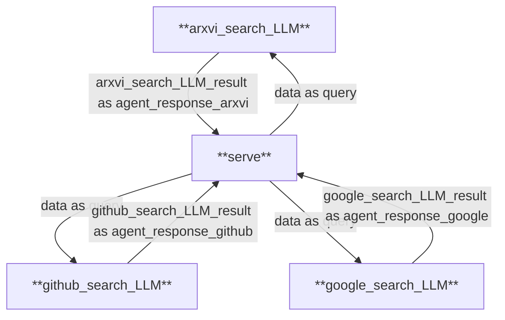

# **Who_Knows**

<!-- PROJECT LOGO -->

<br />

<p align="center">
  <a href="https://github.com/whatiname888/who_knows">
    
  </a>

<h3 align="center">Who_Knows</h3>
  <p align="center">
    基于MoFA的深度智能搜索引擎
    <br />
    <a href="https://github.com/whatiname888/who_knows"><strong>本项目的Github仓库链接 »</strong></a>
    <br />本项目由[爱北京，来工大]团队制作
    <br />
    <a href="https://github.com/whatiname888/who_knows/blob/main/who_knows_search/README.md">查看使用文档</a>
    ·
    <a href="https://github.com/whatiname888/who_knows/issues">报告Bug</a>
    ·
    <a href="https://github.com/whatiname888/who_knows/pulls">提出新特性</a>
  </p>

</p>

# 目录

- [项目简介](#项目简介)
- [Getting_started](#Getting_started)
  - [环境依赖配置](#环境依赖配置)
  - [运行说明](#运行说明)
- [创新点与突破点](#创新点与突破点)
  - [创新点：大小脑设计](#创新点大小脑设计)
  - [突破点：Deepsearch 策略](#突破点deepsearch-策略)
- [技术难点与解决方案](#技术难点与解决方案)
  - [技术难点](#技术难点)
  - [解决方案](#解决方案)
- [运行案例](#运行案例)
- [团队介绍](#团队介绍)
- [鸣谢](#鸣谢)

项目环境：
Python 3.11.10
rust
pip 24.2

## 项目简介
who_knows 是一个基于 mofa 框架，使用 dora 组织数据流的搜索项目。它通过大模型与小模型的协同工作来提炼和过滤海量搜索结果，自动拓展关键词，帮助用户从繁琐的信息中快速找到关键信息，使搜索过程更加高效、直接。

- **核心特点**  
  - 基于智能体协作的架构设计，将用户交互和任务执行分为独立模块
  - 实现动态调整搜索策略，逐层提炼关键信息，保证数据输出的精准与全面
- **功能说明**  
  - xiaowang是一个以智能体驱动的搜索引擎，利用创新的**左右脑设计**与**Deepsearch 策略**实现高效的信息检索和数据分析，为用户提供一个智能、动态、深度且友好的信息获取平台
- **使用场景**  
  - 用户厌倦了传统搜索引擎中良萎不齐的信息来源、铺天盖地的广告宣传与繁琐至极的挨个浏览，希望有一款自动收集信息、自动整理分析的准确高效的新一代搜索引擎。
---
**whoknows-agent搜索引擎架构图**


**agent数据流框图**


## Getting_started

### 环境依赖配置

> 注：请在Linux和MacOS系统上运行，本项目依赖框架暂不支持Windows

**本项目所需框架及语言版本如下**

* Python 3.12.16
  pip 24.2
  Rust 1.81.0
  dora-cli 0.3.6


1. 克隆此项目:

 ```bash
 git clone https://github.com/whatiname888/who_knows.git
 ```

2. 使用Python 3.10或以上环境：

- 如果出现环境版本不匹配，请检查python和pip版本并重新配置,建议使用虚拟环境。

```bash
pip --version
python --version
```

3. 项目环境部署(安装)

- 安装python环境的依赖：

```bash
# 安装 UV 包管理器 加快mofa安装
pip install uv
#安装python后端框架
pip install flask
```

```bash
# 安装 Rust
curl --proto '=https' --tlsv1.2 -sSf https://sh.rustup.rs | sh
# 安装 Dora
cargo install dora-cli
# 验证安装
rustc --version
cargo --version
dora --version
```

```bash
cd mofa/python
# 安装依赖，以下两个命令建议都执行一遍，因为有时uv安装会失败，但是uv的安装速度更快
uv pip install -e .
pip install -e .
```
安装完毕之后，可以使用`mofa --help`命令查看Cli帮助信息

恭喜你，在上述步骤后你已经成功搭建好了运行who_knows的全部基础！！

### 运行说明

在这部分我将讲解如何在你的设备上配置并运行who_knows

由于我们的程序需要使用在线大模型API运行的，因此在启动前要将你的API密钥，模型名称，API接口URL填入配置文件。

以下是我们的项目文件结构：
```
 who_knows/
 ├── image/ # 图片
 ├── mofa/ # mofa框架仓库
 ├── node_hub/ # 各节点代码
 ├── who_knows_search/ # dataflow配置文件
 │ ├── scripts/ # agent配置文件
 │ ├── data/# 视频，照片，实例测试结果
 │ ├── README.md
 │ ├── who_knows_dataflow.yml
 │ └── who_knows_dataflow-graph.html
 ├── .gitignore # Git 忽略文件
 ├── .gitmodules # 项目配置文件
 ├── LICENSE# 许可证
 └── README.md # readme文件
```

打开以下配置文件更改API密钥，模型名称，API接口URL：

`who_knows/node_hub/serve/serve/config.yaml`
`who_knows/node_hub/arxiv_search_LLM/arxiv_search_LLM/config.yaml`
`who_knows/node_hub/github_search_LLM/github_search_LLM/config.yaml`
`who_knows/node_hub/google_search_LLM/google_search_LLM/config.yaml`

本项目使用**Openai**API，以下为config.yaml文件示例：
~~~
api_key:   #您的API密钥
base_url: https://api.deepseek.com  #API的基础URL
model: deepseek-chat #模型名称
~~~

- 顺序执行以下命令以启动智能体流程：

>注：请确保在项目根目录下运行以下命令，并确保运行前进入了虚拟环境
```bash
cd who_knows_search
dora up
dora build who_knows_dataflow.yml
dora start who_knows_dataflow.yml
```

等待显示以下内容后，表示数据流启动成功：
```bash
INFO  dataflow `xxxx-xxx-xxx` on daemon `xxxx-xxx-xxx` google_search_LLM daemon: node is ready
INFO  dataflow `xxxx-xxx-xxx` on daemon `xxxx-xxx-xxx` github_search_LLM daemon: node is ready
INFO  dataflow `xxxx-xxx-xxx` on daemon `xxxx-xxx-xxx` arxiv_search_LLM daemon: node is ready
INFO  dataflow `xxxx-xxx-xxx` on daemon `xxxx-xxx-xxx` daemon: all nodes are ready, starting dataflow
```


打开一个新的终端窗口，进入相同虚拟环境后运行 `whos_serve`

```bash
whos_serve
```
看到以下输出即为yun_serve启动成功：
```bash
 * Serving Flask app 'serve.main'
 * Debug mode: on
WARNING: This is a development server. Do not use it in a production deployment. Use a production WSGI server instead.
 * Running on http://127.0.0.1:5000
Press CTRL+C to quit
 * Restarting with watchdog (inotify)
 * Debugger is active!
 * Debugger PIN: xxx-xxx-xxx
```
>此示例仅作演示使用，实际部署请使用Nginx或其他Web服务器托管。


由于dora启动速度的原因若刚刚执行完 `dora start who_knows_dataflow.yml`立马执行 `whos_serve`可能会报错，如遇报错请等待几秒后再次执行`whos_serve`命令。

打开浏览器，输入`http://localhost:5000/`，进入到搜索引擎主页，输入查询内容，点击搜索按钮，即可看到搜索结果。

> 注：由于网络及电脑性能等原因，输出可能有不同程度延迟，请耐心等待模型输出结果。

## 创新点与突破点

###  创新点：大小脑设计

- **小脑（交互模块）**  
  负责与用户实时沟通，通过自然语言理解技术获取查询意图，并实时反馈交互状态。

- **大脑（任务代理模块）**  
  分工明确、协同工作的智能代理集合，负责处理所有后端任务，包括数据的初步抓取和深层次的关联搜索，确保输出的结果准确而全面。

- **总结**  
  我们设计的实时交互中继架构，采用双模型协同工作机制：前端轻量化交互模型专责对话流维持与结果渲染，在用户发起请求的瞬间即生成交互反馈信号（<200ms）；后端智能路由模型同步执行多模态语义解析，通过动态关键词提取引擎并行检索GitHub/arXiv/Google三大知识库。两套模型通过事件驱动型信息流实现解耦，使得界面响应延迟与后端计算耗时完全隔离。该架构确保每个用户查询经历「交互保障→语义解析」两次独立模型处理阶段，在维持零停顿对话体验的同时，为后续扩展自定义爬虫接口预留了标准化接入点。


###  突破点：Deepsearch 策略

- **初步搜索：**  
  用户输入查询内容后，系统将会首先提取关键信息，通过爬虫技术抓取互联网数据形成初步搜索结果。

- **深层关联分析：**  
  根据初步结果进一步提炼关键词，开展第二轮更深层次的搜索，从而精细挖掘出隐藏的价值和关联信息。


## 技术难点与解决方案

### 技术难点
123
### 解决方案
123


## 运行案例

### 案例一

**用户：**
```

```

**who_knows：**
```
答案
```
---

## 团队介绍
### 团队分工

- 胡宇桥：负责两个agent的代码编写和最终应用调试作业、markdown文档主要撰写者
- 杨淏森：负责反思模型的提示词工程，markdown文档撰写者。

## 鸣谢

- [Mofa](https://github.com/moxin-org/mofa)
- [吴宗寰老师](https://china2024.gosim.org/zh/speakers/zonghuan-wu)
- [陈成老师]
- [赵志举老师]
- [阿图教育]

