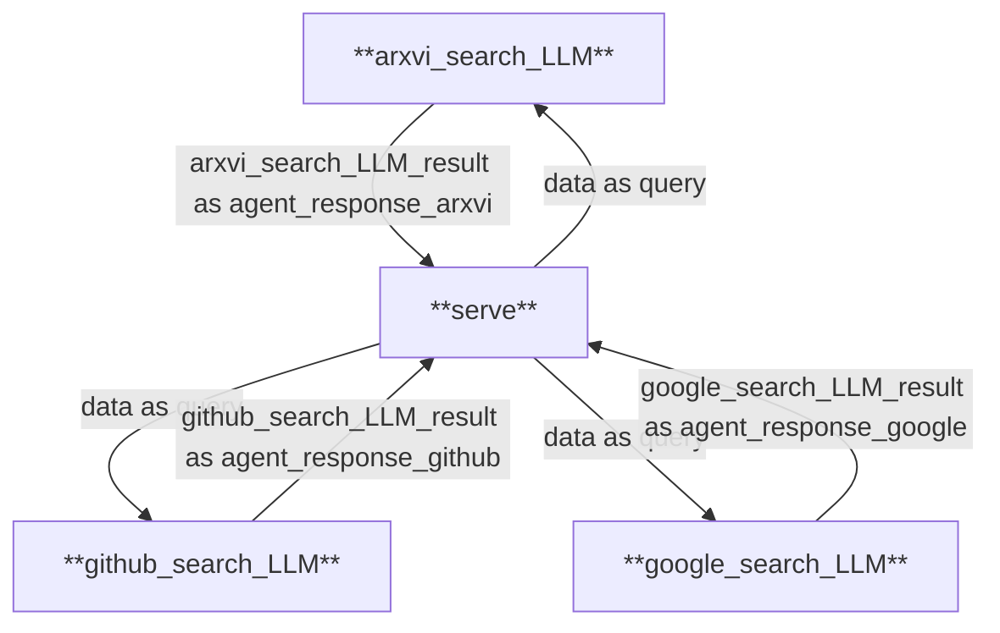

# **who_knows_search**


## **项目概述**
who_knows 是一个基于 mofa 框架，使用 dora 组织数据流的搜索项目。它通过大模型与小模型的协同工作来提炼和过滤海量搜索结果，自动拓展关键词，帮助用户从繁琐的信息中快速找到关键信息，使搜索过程更加高效、直接。

## **团队信息**
- **团队名称**: who_knows团队
- **项目成员**:
  - 胡宇桥 (GitHub用户名: whatiname)
  - 杨淏森 (GitHub用户名: wrfdafaf)
- **项目地址**: [GitHub Repo](https://github.com/whatiname888/who_knows.git)

## **核心功能**
- 基础智能体架构
- 输入输出参数处理
- 日志记录与调试
- 分布式节点通信

## **技术架构**


## **安装与运行**

### **环境依赖**
1. Rust (用于运行 Dora-RS 框架)
2. MoFa 框架库


### **运行程序**
```bash
dora up
dora build who_knows_dataflow.yml
dora start who_knows_dataflow.yml
```

等待显示以下内容后，表示数据流启动成功：
```bash
INFO  dataflow `xxxx-xxx-xxx` on daemon `xxxx-xxx-xxx` google_search_LLM daemon: node is ready
INFO  dataflow `xxxx-xxx-xxx` on daemon `xxxx-xxx-xxx` github_search_LLM daemon: node is ready
INFO  dataflow `xxxx-xxx-xxx` on daemon `xxxx-xxx-xxx` arxiv_search_LLM daemon: node is ready
INFO  dataflow `xxxx-xxx-xxx` on daemon `xxxx-xxx-xxx` daemon: all nodes are ready, starting dataflow
```
打开一个新的终端窗口，进入相同虚拟环境后运行 `whos_serve`

```bash
whos_serve
```

看到以下输出即为yun_serve启动成功：
```bash
 * Serving Flask app 'serve.main'
 * Debug mode: on
WARNING: This is a development server. Do not use it in a production deployment. Use a production WSGI server instead.
 * Running on http://127.0.0.1:5000
Press CTRL+C to quit
 * Restarting with watchdog (inotify)
 * Debugger is active!
 * Debugger PIN: xxx-xxx-xxx
```

>此示例仅作演示使用，实际部署请使用Nginx或其他Web服务器托管。


由于dora启动速度的原因若刚刚执行完 `dora start who_knows_dataflow.yml`立马执行 `whos_serve`可能会报错，如遇报错请等待几秒后再次执行`whos_serve`命令。

打开浏览器，输入`http://localhost:5000/`，进入到搜索引擎主页，输入查询内容，点击搜索按钮，即可看到搜索结果。


> 注：由于网络及电脑性能等原因，输出可能有不同程度延迟，请耐心等待模型输出结果。


## **配置文件说明**

### **hello_world_dataflow.yml**
```yaml
nodes:
  - id: serve
    build: pip install -e ../node_hub/serve
    path: dynamic
    outputs:
      - data
    inputs:
      agent_response_github: github_search_LLM/github_search_LLM_result
      agent_response_arxiv: arxiv_search_LLM/arxiv_search_LLM_result
      agent_response_google: google_search_LLM/google_search_LLM_result

  - id: arxiv_search_LLM
    build: pip install -e ../node_hub/arxiv_search_LLM
    path: arxiv_search_LLM
    outputs:
      - arxiv_search_LLM_result
    inputs:
      query: serve/data
    
  - id: github_search_LLM
    build: pip install -e ../node_hub/github_search_LLM
    path: github_search_LLM
    outputs:
      - github_search_LLM_result
    inputs:
      query: serve/data
  
  - id: google_search_LLM
    build: pip install -e ../node_hub/google_search_LLM
    path: google_search_LLM
    outputs:
      - google_search_LLM_result
    inputs:
      query: serve/data


    env:
      IS_DATAFLOW_END: true
      WRITE_LOG: true
```

### **配置项说明**
- **serve**: 服务器节点
  - `build`: 安装依赖
  - `outputs`: 输出数据标识
  - `inputs`: 接收agent的响应
- **xxxx_search_LLM**: 智能体节点
  - `build`: 安装依赖
  - `outputs`: 输出结果标识
  - `inputs`: 接收用户请求

## **测试案例**

## **日志说明**
日志文件位于 `out/` 目录下：
- `xxxx-xxx-xxx-xxxx/log_xxxx_search_LLM.txt`: 智能体运行日志
- `dora-coordinator.txt`: 协调器日志
- `dora-daemon.txt`: 守护进程日志


